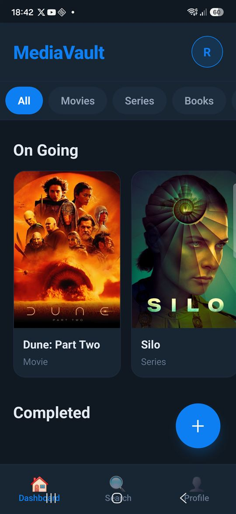
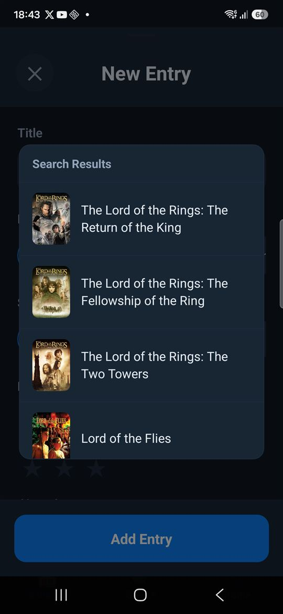
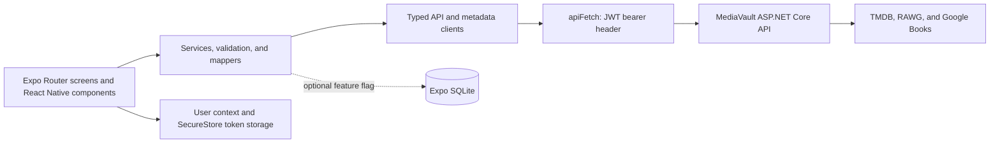

# MediaVault Android

MediaVault is a personal library for movies, TV series, games, books, and
manga. This repository contains the Expo/React Native Android client; it uses
the shared [MediaVault API and web application](https://github.com/Megaraz/media-vault-app)
for authenticated library and metadata-provider operations.

> **Status:** active pre-release development. The Android client supports the
> core library workflows described below, but it is not a production release
> and does not provide offline synchronization.

[](https://github.com/Megaraz/media-vault-android/actions/workflows/ci.yml)

## Product tour

The screenshots use a synthetic demo account and demonstration library data. They
show no account email, token, API credential, local path, or private library
data.

### Organize a personal library

The authenticated dashboard groups entries by status and lets users filter by
media type, open an entry, or start a new one.



### Search an external catalog

In the new-entry sheet, typing at least three title characters searches the
backend for the selected media type. The backend owns calls to TMDB, RAWG, and
Google Books; provider credentials are never sent to this app.



### Review imported metadata before saving

Selecting a search result fills editable metadata fields. It does not save the
entry automatically.


## What works today

- JWT bearer registration, login, persisted session restoration, logout, and
  protected routes
- Dashboard grouping by status, media-type filters, and a library search tab
- Create, read, update, and delete workflows for movies, TV series, games,
  books, and manga
- Ratings, reviews, genres, release details, artwork, and type-specific fields
- Provider-backed title search and editable metadata autofill
- Android token storage through `expo-secure-store`
- An opt-in Expo SQLite persistence path, controlled by a feature flag

### Current limitations and direction

- The opt-in client database is not offline synchronization. There is no
  conflict policy, server-to-client synchronization, or production recovery
  workflow.
- No production Android build or app-store distribution is provided.
- The checked-in source supports Expo's Android workflow. iOS and web scripts
  exist because Expo exposes them, but this project does not claim they have
  been manually tested.
- Offline sync, production distribution, observability, and AI recommendations
  are roadmap work, not current features.

## Current direction

MediaVault is being developed as a useful personal product, a public portfolio,
and a learning environment for sound engineering judgment. The current roadmap
includes deliberate work on API resilience and observability, a designed
offline-sync model for Android, production-minded distribution, and a narrow,
privacy-conscious AI recommendation feature. Any future recommendation flow
will keep model credentials on the backend, minimize the taste data it sends,
validate the response, and require user confirmation before it affects trusted
library data.

These are directions, not claims about the current Android implementation. See
the [MediaVault GitHub Project](https://github.com/users/Megaraz/projects/2)
for tracked work.

## Architecture



Screens and components own presentation, navigation, form state, and user
feedback. Services coordinate workflows, validation, API clients, mapping, and
the optional local repository path. The backend remains authoritative for
shared account and library data.

| Path | Responsibility |
| --- | --- |
| `app/` | Expo Router routes, protected layouts, and screens |
| `components/` | Reusable UI, including the media-entry sheet and form |
| `clients/` | MediaVault API and backend metadata-search clients |
| `services/`, `mappers/`, `validators/` | Workflows, DTO mapping, and input validation |
| `shared/` | Authentication context, SecureStore token handling, authorized fetch, and feature flags |
| `database/` | Opt-in Expo SQLite initialization, migrations, and repositories |
| `packages/result-pattern-typescript/` | Repository-owned TypeScript ResultPattern dependency |

## Run locally

### Prerequisites

- [Node.js](https://nodejs.org/) 20.19.x or newer
- npm
- An Android emulator or physical Android device; [Expo Go](https://expo.dev/go)
  is suitable for the current managed workflow
- A running local instance of the [MediaVault API](https://github.com/Megaraz/media-vault-app)

This project uses Expo SDK `~54.0.36`, React Native `0.81.5`, and React
`19.1.0`. Expo SDK 54 requires Node.js 20.19.x or newer and targets React
Native 0.81; see the [versioned Expo SDK 54 reference](https://docs.expo.dev/versions/v54.0.0/).

### 1. Configure the API URL

Copy the safe example and edit the ignored local file:

```powershell
Copy-Item .env.example .env.local
```

```dotenv
# Android emulator: API running on the development machine
EXPO_PUBLIC_MEDIA_VAULT_API_URL=http://10.0.2.2:5210

# Keep disabled unless deliberately testing the local database path.
EXPO_PUBLIC_USE_CLIENT_DATABASE=false
```

`EXPO_PUBLIC_MEDIA_VAULT_API_URL` is the backend base URL. Every
`EXPO_PUBLIC_*` value is embedded in the client bundle: use it only for public
runtime configuration, never for a password, JWT, provider key, or other
secret.

For networking:

- An Android Emulator reaches an API on the host machine through
  `http://10.0.2.2:5210`, not `localhost`.
- A physical device must use the development machine's reachable LAN address,
  for example `http://192.168.1.20:5210`, and the API must be configured to
  listen safely on that interface. Do not commit that local address.
- `http://localhost:5210` is only appropriate when the app process itself can
  reach that localhost address; it is not the normal physical-device setting.

Follow the backend repository's local setup instructions to configure, migrate,
and start the API. Its development HTTP profile listens on port 5210.

### 2. Install and start the Android app

```powershell
npm ci
npm run android
```

`npm run android` starts Expo and opens the project on an available Android
emulator or connected device. To start Metro without choosing a target, use
`npm start` and follow the Expo prompt.

## Authentication and local data

The API uses JWT bearer authentication. On Android, `shared/tokenStore.ts`
stores the token with `expo-secure-store`; `shared/apiFetch.ts` is the central
place that attaches the `Authorization: Bearer` header. Tokens must never be
placed in AsyncStorage, source code, logs, or `EXPO_PUBLIC_*` values.

`EXPO_PUBLIC_USE_CLIENT_DATABASE=false` is the default. Setting it to `true`
initializes an Expo SQLite database and its checked-in migrations. This is an
opt-in, experimental local persistence path—not a replacement for backend
ownership and not an offline-sync solution. Local database files are runtime
data and are ignored by Git.

## Verification

Run these checks from the repository root:

```powershell
npm ci
npm run lint
npx tsc --noEmit
npx expo-doctor
git diff --check
```

The CI workflow runs the first four commands for pull requests and pushes to
`main` on Ubuntu with Node.js 20.19.x. The documented clean-clone verification
also completed an Android Expo export. The Expo toolchain may report its
existing `@noble/hashes/crypto.js` package-exports fallback warning during that
export; it is not a claim of a production build.

For an Android UI or networking change, test the supported emulator or physical
device path manually. This README change does not claim a fresh device test.

## Troubleshooting

### The app cannot reach the API

- Confirm that the API is running and that `.env.local` contains the correct
  `EXPO_PUBLIC_MEDIA_VAULT_API_URL` for the target.
- For an emulator, use `10.0.2.2` instead of the host's `localhost`.
- For a device, verify that the device and development machine can reach each
  other on the same trusted network and that the API is listening on the chosen
  address.
- Restart Expo after changing `.env.local` so the public configuration is
  reloaded.

### Expo reports a compatibility or configuration problem

```powershell
npx expo-doctor
```

Use `npx expo install <package>` for Expo-managed packages so their versions
remain compatible with SDK 54. Do not upgrade dependencies or run broad audit
fixes as a substitute for diagnosing the reported problem.

### Lint or type checking fails

```powershell
npm run lint
npx tsc --noEmit
```

Use `npm ci` to restore exactly the checked-in dependency tree before
investigating a local installation problem.

## Project and community

- [MediaVault API and web application](https://github.com/Megaraz/media-vault-app)
- [Build in Public parent issue](https://github.com/Megaraz/media-vault-app/issues/55)
- [MediaVault GitHub Project](https://github.com/users/Megaraz/projects/2)
- [Android README issue](https://github.com/Megaraz/media-vault-android/issues/2)
- [Continuous integration and default-branch gates](docs/continuous-integration.md)
- [Public repository readiness audit](docs/public-repository-readiness-audit.md)
- [Contributing](CONTRIBUTING.md)
- [Code of Conduct](CODE_OF_CONDUCT.md)
- [Security](SECURITY.md)
- [MIT License](LICENSE)
