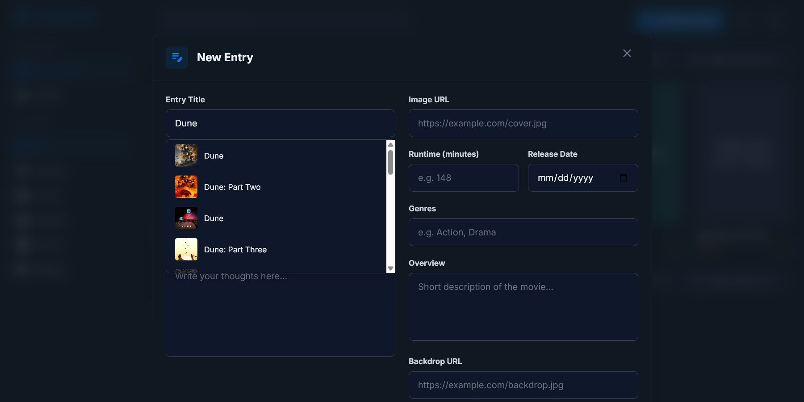
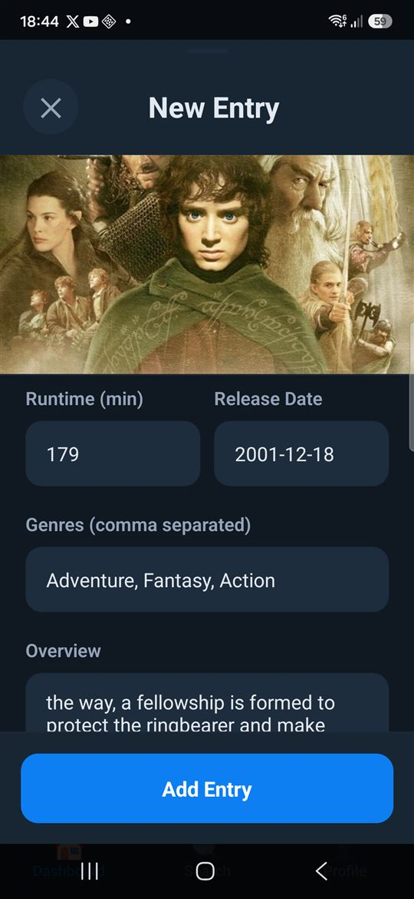
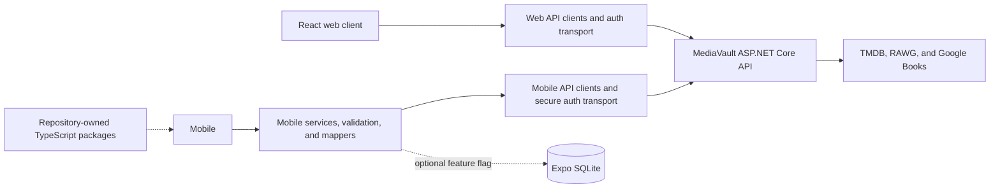

# MediaVault Clients

> Part of the **[MediaVault project](https://github.com/Megaraz/MediaVault)**.
> For the product overview, cross-repository architecture, roadmap, and
> one-command workspace setup, start in the main repository. Backend code lives
> in **[MediaVault.Api](https://github.com/Megaraz/MediaVault.Api)**.

MediaVault is a personal library for movies, TV series, games, books, and
manga. This repository contains the React web client and the Expo/React Native
mobile client. Both use the separate
[MediaVault API](https://github.com/Megaraz/MediaVault.Api) for authenticated
library operations and external metadata.

> **Status:** active pre-release development. The core web and Android
> workflows are functional, but neither client is a production release and
> general offline synchronization is not implemented.

[](https://github.com/Megaraz/MediaVault.Clients/actions/workflows/ci.yml)

## Product tour

The screenshots use synthetic demo accounts and fictional library data. They
show no real account details, tokens, API credentials, or private library data.

### Web client

The authenticated web dashboard groups entries by status and supports
media-type filtering, library search, sorting, and create/edit flows.


Typing at least three title characters searches the appropriate external
catalog through the backend.



Selecting a result fills editable fields without saving the entry
automatically.


### Mobile client

The Android dashboard provides the same core library workflows in an
Expo/React Native interface.


The mobile entry sheet searches backend metadata providers and lets the user
review imported data before saving.




## What works today

Both clients support:

- JWT bearer registration, login, authenticated profile access, and protected
  library operations;
- create, read, update, and delete workflows for movies, TV series, games,
  books, and manga;
- status, rating, review, genre, release, artwork, and type-specific metadata;
- provider-backed title search and editable metadata autofill; and
- centralized API transport and authentication handling.

The web client provides dashboard grouping, filtering, search, sorting, and
modal create/edit flows. The mobile client adds persisted session restoration
through `expo-secure-store`, protected Expo Router routes, and an opt-in Expo
SQLite persistence path controlled by `EXPO_PUBLIC_USE_CLIENT_DATABASE`.

## Repository layout

```text
MediaVault.Clients/
├── apps/
│   ├── mobile/       Expo, React Native, and Expo Router
│   └── web/          React, TypeScript, Vite, and Tailwind
├── packages/
│   ├── client-core/                  Pure operations, validation, and mapping
│   ├── contracts/                    Shared API DTOs and enum values
│   └── result-pattern-typescript/    ResultPattern v2 for client runtimes
├── package.json      npm workspace configuration and shared scripts
└── package-lock.json one lock file for all workspaces
```

The npm workspace establishes repository-level dependency installation and
script orchestration. `packages/contracts` is the API-owned source of truth for
shared DTOs and numeric enum values. Both clients import those contracts from
`@mediavault/contracts`; their presentation labels, `All = -1` filter sentinel,
form/view state, and persistence models remain application-owned. Android's
contract boundary and Metro verification are documented in
`apps/mobile/docs/shared-contracts.md`.
`packages/result-pattern-typescript` provides the platform-neutral, safe Result
contract consumed by `packages/client-core`. Both applications use the core for
approved API operations, validation, and provider metadata mapping; their
storage, transport, UI, and persistence adapters remain application-owned.

## Architecture



The backend remains authoritative for shared account and library data. Provider
credentials stay on the API; neither client receives RAWG, TMDB, or Google
Books credentials.

## Run locally

### Prerequisites

- [Node.js 24](https://nodejs.org/) and npm. Expo SDK 54 requires at least
  Node.js 20.19.x.
- A running local [MediaVault API](https://github.com/Megaraz/MediaVault.Api).
- For mobile development, an Android emulator or physical Android device.
- For the HTTPS web development server, a trusted ASP.NET Core development
  certificate created with `dotnet dev-certs https --trust`.

Install every workspace from the repository root:

```powershell
npm ci
```

### Start the web client

```powershell
npm run dev:web
```

Open `https://localhost:61366`. Vite proxies API routes to
`http://localhost:5210` by default. `ASPNETCORE_HTTPS_PORT` or
`ASPNETCORE_URLS` can override the target.

### Configure and start the mobile client

Copy the safe example and edit the ignored local file:

```powershell
Copy-Item apps/mobile/.env.example apps/mobile/.env.local
```

```dotenv
# Android emulator: API running on the development machine
EXPO_PUBLIC_MEDIA_VAULT_API_URL=http://10.0.2.2:5210

# Keep disabled unless deliberately testing local mobile persistence.
EXPO_PUBLIC_USE_CLIENT_DATABASE=false
```

Every `EXPO_PUBLIC_*` value is embedded in the client bundle. Use these values
only for public runtime configuration, never for passwords, JWTs, provider
keys, or other secrets.

Start the Android workflow from the repository root:

```powershell
npm run android
```

An Android emulator reaches an API on the host through `10.0.2.2`, not
`localhost`. A physical device must use a reachable LAN address and the API
must be configured safely to listen on that interface.

## Authentication and local data

Both clients attach JWT bearer tokens through centralized transport helpers.
The mobile client stores its token with `expo-secure-store`; tokens must never
be moved to AsyncStorage, source code, logs, or `EXPO_PUBLIC_*` values.

The optional mobile database is experimental local persistence, not offline
synchronization. The API remains authoritative, and local database files are
ignored runtime state.

## Verification

Run from the repository root:

```powershell
npm ci
npm run lint
npm run typecheck:mobile
npm run doctor:mobile
npm run build:web
npm run test:client-core
npm run test:contracts
npm run test:result-pattern
git diff --check
```

CI runs independent mobile and web jobs. The mobile lint currently completes
with existing warnings but no errors. Neither application has an established
automated UI test suite.

## Current limitations and direction

- No production web deployment, Android distribution, or app-store release is
  provided.
- The mobile SQLite path is not a general synchronization implementation.
- iOS and Expo web scripts exist, but this repository does not claim they have
  been manually validated.
- Client adoption of the shared contracts and client core, React Query,
  offline sync, production telemetry, and AI recommendations remain future
  work unless the checked-in code proves otherwise.

Current work is tracked in the
[MediaVault GitHub Project](https://github.com/users/Megaraz/projects/2).

## Project and community

- [MediaVault API](https://github.com/Megaraz/MediaVault.Api)
- [Continuous integration and default-branch gates](apps/mobile/docs/continuous-integration.md)
- [Public repository readiness audit](apps/mobile/docs/public-repository-readiness-audit.md)
- [Contributing](CONTRIBUTING.md)
- [Code of Conduct](CODE_OF_CONDUCT.md)
- [Security](SECURITY.md)
- [MIT License](LICENSE)
